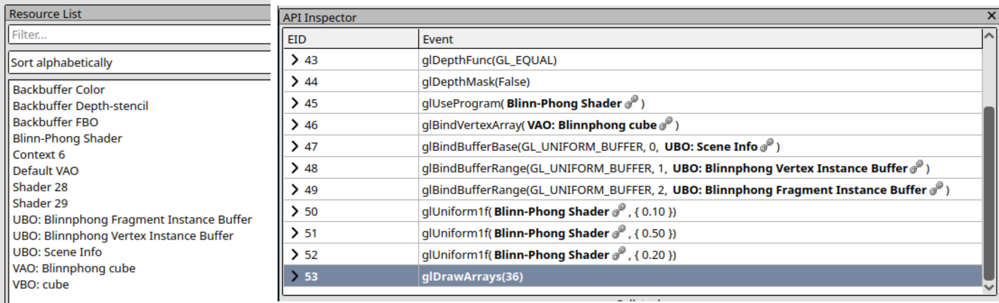
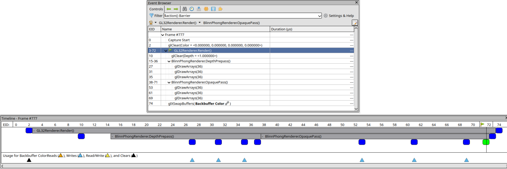
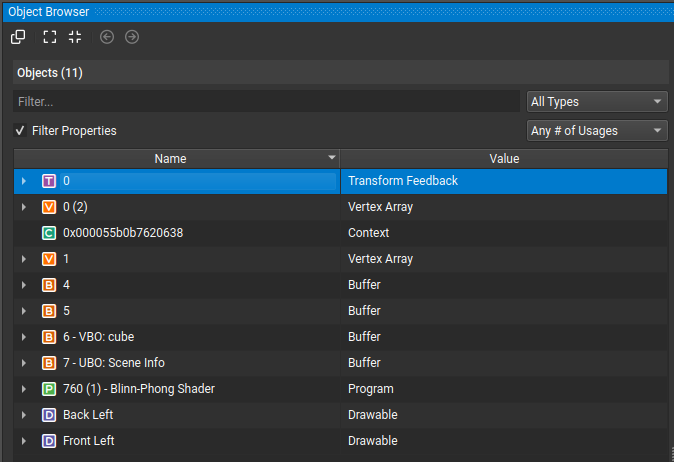
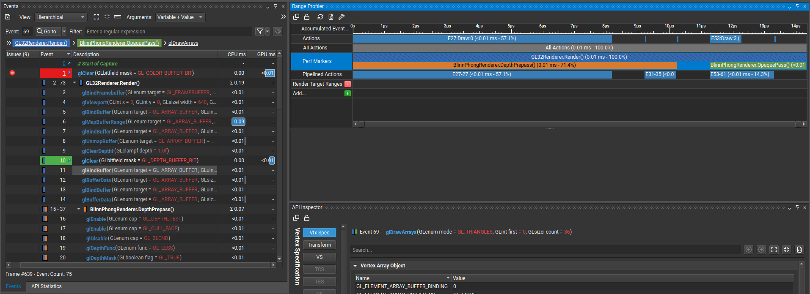

KHR_debug Extension
===================
`KHR_debug` is an extension that provides additional functions to the OpenGL API
which aids development and debugging of OpenGL applications. This extension is
available on many drivers and has been core since OpenGL version 4.3. Please
read the previous article on the topic, [Debug Callback](debug_callback.md),
before reading this as it provides better context into this extension.

For versions of OpenGL later than 4.3 or if the extension is present you can
directly use the function as defined in the `GL` class. For OpenGLES contexts
use the `GL.Khr` class. The subclass version is a drop-in replacement for the
core version for ES contexts. This extension only works when the OpenGL context
has the "Debug" flag set. This is different from building and running your
application in debug mode under your IDE. This is how you can tell OpenTK to
create a context with the debug flag set.

# [OpenTK 4.0](#tab/debug-context-4)
```cs
using OpenTK;
using OpenTK.Windowing.Desktop;

// ...

GameWindow window = new GameWindow(
    GameWindowSettings.Default,
    new NativeWindowSettings() {
        Flags = ContextFlags.Debug
    });
```
# [OpenTK 3.0](#tab/debug-context-3)
```cs
using OpenTK;
using OpenTK.Graphics;

// ...

GameWindow window = new GameWindow(
    width, height,                  // Window width.
    GraphicsMode.Default,           // Context graphics mode.
    title,                          // Window title.
    GameWindowFlags.Default,        // GameWindow flags.
    DisplayDevice.Default,          // The display to create the window in.
    3, 3,                           // OpenGL context version major then minor.
    GraphicsContextFlags.Debug);    // OpenGL context flags.
```
***
<br/>

Debug Message API
-----------------
The debug message API provides functionality for sending and receiving debug
messages to applications using OpenGL.

### `GL.DebugMessageCallback()`
This function allows you to set the callback that will receive debug messages.
It is only mentioned here as it has been extensively described in the
[Debug Callback](debug_callback.md) article.

### `GL.DebugMessageControl()`
This function allows you to control the debugging messages that will be received
by the callback.
```cs
void GL.DebugMessageControl(
    DebugSourceControl source,      /* Select debug sources or all. */
    DebugTypeControl type,          /* Select message types or all. */
    DebugSeverityControl severity,  /* Select message severity or all */
    int numIds,     /* Number of IDs to supply. */
    int[] ids,      /* Array of IDs */
    bool isEnabled  /* Enable or disable. */
);
```
The parameter `source` is the message source filter. It can be your own
application or components of the OpenGL or windowing API. `type` filters which
message types to control. `severity` filters which severity to control. In
addition to this, the enum value `.DontCare` does not filter any message type.
When `numIds` is positive, ids is an array of message IDs to filter. You can use
`0` and `System.Array.Empty<int>()` if you don't want to feed the function any
message IDs. And finally `isEnabled` controls if the filtered messages are to be
permitted or ignored.

This function is especially useful for turning down warnings that you do not
desire to see. Since the messages generated are driver specific, it might be
useful to keep a list of IDs you might want to mute or permit per vendor, that
way your debugging logs are clear of any frequent informational messages.

### `GL.DebugMessageInsert()`
The following function allows you to insert a custom message into the debug
message stream. The parameters are similar to that of `GL.DebugMessageControl`
filter parameters.
```cs
void GL.DebugMessageInsert(
    DebugSourceExternal source, /* Source of the message. */
    DebugType type,             /* Type of the message. */
    int id,                     /* An ID to associate with this message. */
    DebugSeverity severity,     /* Severity of the message. */
    int length,                 /* Length of the message or -1 for automatic. */
    string message              /* The message to insert. */
);
```

> [!WARNING]
> The `length` parameter for most of the functions given are intended for C
> users and is in ASCII characters, not UTF-16 characters. This causes a small
> disparity between the length of a string in C#, and it's length in bytes after
> marshalling between UTF-16 and ASCII/UTF-8 characters.
>
> Although in some cases (particularly where only 7-bit ASCII characters are
> used) the number of characters in the C# string and the number of characters
> in the C string are going to match, the most appropriate way would be to
> measure the length of the string in bytes using
> `System.Text.Encoding.UTF8.GetByteCount()`. However, that still takes
> significant time and effort, so you might just want to use `-1` instead.
>
> Using `-1` is allowed by the extension as the length of a string, where the
> graphics driver will calculate the length of the null terminated C string
> itself.

### `GL.GetDebugMessageLog()`
In the absense of a debug message callback, this function can be used to
retreive debug messages that have been enqueued by the OpenGL context. The
messages are retrieved in FIFO (first-in-first-out) fashion.

```cs
int GL.GetDebugMessageLog(
    int count,                  /* Number of messages to retreive. */
    int bufferSize,             /* Message buffer size. */
    out DebugSource sources,    /* Retrieved message sources. */
    out DebugType types,        /* Retrieved message types. */
    out int ids,                /* Retrieved message IDs. */
    out DebugSeverity severity, /* Retrieved message severities */
    out int length,             /* Retrieved message lengths. */
    out string message          /* Retrieved messages. */
);  /* Returns: The number of messages retreived. */
```

> [!NOTE]
> The `out` overload will only work if you if the `count` parameter is `1`.
> You should use the array overload if you want to capture many debug messages
> at once. This overload is not shown for brevity sake, but the order of the
> parameters and their purposes are equivalent.

### Additional Enables
These additional enables are introduced to the API which allows you to control
the debug messaging with `GL.Enable()` and `GL.Disable()`.

| EnableCap | Description |
|:----------|:------------|
| `EnableCap.DebugOutput` | Enable or disable debug message generation. If disabled, inhibits sending messages to your callback. |
| `EnableCap.DebugOutputSynchronous` | When enabled, debug messages are sent only to the thread that generated the message. Useful when debugging and viewing the callstack. Hinders performance. |

Object Label API
----------------
The object label API allows you to give custom labels to OpenGL objects. These
labels are then displayed in the debug messages and graphics debuggers.
Immensely more descriptive than the number assigned by the OpenGL context for
each OpenGL object or a pointer.

```cs
/* Label named objects (i.e. objects with handles). */
void GL.ObjectLabel(
    ObjectLabelIdentifier identifier,   /* Object family, e.g. a buffer or a texture. */
    int handle,     /* The object handle. */
    int length,     /* Length of the label, or -1 for automatic length. */
    string label    /* The label to give the object. */
);

/* Label pointer objects (almost exclusively for naming sync objects)*/
void GL.ObjectPtrLabel(
    IntPtr pointer, /* The pointer to label. */
    int length,     /* Length of the label, or -1 for automatic length. */
    string label    /* The label to give to the pointer. */
);
```

Debug Group API
---------------
The debug group API allows you to group some commands under a label. These
labels are then displayed by graphics debuggers in a tree fashion. This provides
additional visual aid and context clues when reading large command lists when
trying to figure out what went wrong.

```cs
/* Pushes a new frame onto the debug group stack. */
void GL.PushDebugGroup(
    DebugSourceExternal source, /* The source of the message. */
    int id,         /* An ID to give the message. This is for your own use. */
    int length,     /* Length of the message, use -1 for automatic length. */
    string message  /* The label message to group following calls. */
);

/* Pops a previously pushed debug group from the stack. */
void GL.PopDebugGroup();
```

Associated new Gets
-------------------
This extension has the following new gets associated with it.

| Get Function | Get Enum | Initial Value | Description |
|--------------|----------|---------------|-------------|
| `GL.GetPointer` | `GetPointervPName.DebugCallbackFunction` | `null` | The debug callback function you provided. |
| `GL.GetPointer` | `GetPointervPName.DebugCallbackUserParam` | `null` | The user param value you provided to the debug callback function. |
| `GL.GetInteger` | `All.DebugLoggedMessages` | 0 | The number of messages currently in the debug log. |
| `GL.GetInteger` | `All.DebugNextLoggedMessageLength` | 0 | Length of the next log message in queue. |
| `GL.GetInteger` | `All.DebugGroupStackDepth` | 1 | The number of frames in the debug group stack. |
| `GL.IsEnabled`  | `EnableCap.DebugOutput` | `false` | Is debug output enabled? |
| `GL.IsEnabled`  | `EnableCap.DebugOutputSynchronous` | `false` | Is debug output synchronous? |

Screenshots
-----------

### Renderdoc
<div class="figure">

<p>Object labels in Renderdoc Resource List (left) and API Inspector (right)</p>
</div>

<div class="figure">

<p>Debug groups in Renderdoc Event Browser (top) and Timeline (bottom)</p>
</div>

### Nvidia Nsight
<div class="figure">

<p>Object labels in Nsight Object Browser.</p>
</div>

<div class="figure">

<p>Debug groups in Nvidia Nsight Events list (left) and Range Profiler (top-right)</p>
</div>

<!-- I don't like putting inline css here but here we are. -->
<style>
    div.figure {
        padding: 4pt;
        text-align: center;
        align: center;
    }
</style>

References
----------
* [Debug Messages on Khronos MeadiaWiki](https://www.khronos.org/opengl/wiki/Debug_Output)
* [KHR_debug on Khronos Registry](https://registry.khronos.org/OpenGL/extensions/KHR/KHR_debug.txt)
