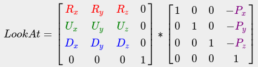

# Camera
In the previous tutorial we discussed the view matrix and how we can use the view matrix to move around the scene (we moved backwards a little). OpenGL by itself is not familiar with the concept of a *camera*, but we can try to simulate one by moving all objects in the scene in the reverse direction, giving the illusion that **we** are moving.

In this tutorial we'll discuss how we can set up a camera in OpenGL. We will discuss an FPS-style camera that allows you to freely move around in a 3D scene. In this tutorial we'll also discuss keyboard and mouse input and finish with a custom camera class.

## Camera/View space
When we're talking about camera/view space we're talking about all the vertex coordinates as seen from the camera's perspective as the origin of the scene: the view matrix transforms all the world coordinates into view coordinates that are relative to the camera's position and direction. To define a camera we need its position in world space, the direction it's looking at, a vector pointing to the right and a vector pointing upwards from the camera. A careful reader might notice that we're actually going to create a coordinate system with 3 perpendicular unit axes with the camera's position as the origin.


### 1. Camera position
Getting a camera position is easy. The camera position is basically a vector in world space that points to the camera's position. We set the camera at the same position we've set the camera in the previous tutorial:


```cs
glm::vec3 cameraPos = glm::vec3(0.0f, 0.0f, 3.0f);
``` 
> Don't forget that the positive z-axis is going through your screen towards you so if we want the camera to move backwards, we move along the positive z-axis.
### 2. Camera direction
The next vector required is the camera's direction e.g. at what direction it is pointing at. For now we let the camera point to the origin of our scene: **(0,0,0)**. Remember that if we subtract two vectors from each other we get a vector that's the difference of these two vectors? Subtracting the camera position vector from the scene's origin vector thus results in the direction vector. Since we know that the camera points towards the negative z direction we want the direction vector to point towards the camera's positive z-axis. If we switch the subtraction order around we now get a vector pointing towards the camera's positive z-axis:


```cs
glm::vec3 cameraTarget = glm::vec3(0.0f, 0.0f, 0.0f);
glm::vec3 cameraDirection = glm::normalize(cameraPos - cameraTarget);
```
> The name direction vector is not the best chosen name, since it is actually pointing in the reverse direction of what it is targeting.
### 3. Right axis
The next vector that we need is a *right* vector that represents the positive x-axis of the camera space. To get the *right* vector we use a little trick by first specifying an *up* vector that points upwards (in world space). Then we do a cross product on the up vector and the direction vector from step 2. Since the result of a cross product is a vector perpendicular to both vectors, we will get a vector that points in the positive x-axis's direction (if we would switch the vectors we'd get a vector that points in the negative x-axis):


```cs
glm::vec3 up = glm::vec3(0.0f, 1.0f, 0.0f); 
glm::vec3 cameraRight = glm::normalize(glm::cross(up, cameraDirection));
```
### 4. Up axis
Now that we have both the x-axis vector and the z-axis vector, retrieving the vector that points in the camera's positive y-axis is relatively easy: we take the cross product of the right and direction vector:


```cs
glm::vec3 cameraUp = glm::cross(cameraDirection, cameraRight);
```
With the help of the cross product and a few tricks we were able to create all the vectors that form the view/camera space. For the more mathematically inclined readers, this process is known as the [Gram-Schmidt](https://en.wikipedia.org/wiki/Gram%E2%80%93Schmidt_process) process in linear algebra. Using these camera vectors we can now create a ***LookAt*** matrix that proves very useful for creating a camera.

## Look At
A great thing about matrices is that if you define a coordinate space using 3 perpendicular (or non-linear) axes you can create a matrix with those 3 axes plus a translation vector and you can transform any vector to that coordinate space by multiplying it with this matrix. This is exactly what the LookAt matrix does and now that we have 3 perpendiclar axes and a position vector to define the camera space we can create our own LookAt matrix:


Where ***R*** is the right vector, ***U*** is the up vector, ***D*** is the direction vector and ***P*** is the camera's position vector. Note that the position vector is inverted since we eventually want to translate the world in the opposite direction of where we want to move. Using this LookAt matrix as our view matrix effectively transforms all the world coordinates to the view space we just defined. The LookAt matrix then does exactly what it says: it creates a view matrix that *looks* at a given target.

Luckily for us, GLM already does all this work for us. We only have to specify a camera position, a target position and a vector that represents the up vector in world space (the up vector we used for calculating the right vector). GLM then creates the LookAt matrix that we can use as our view matrix:


```cs 
glm::mat4 view;
view = glm::lookAt(glm::vec3(0.0f, 0.0f, 3.0f), 
  		   glm::vec3(0.0f, 0.0f, 0.0f), 
  		   glm::vec3(0.0f, 1.0f, 0.0f));
```
The `glm::LookAt` function requires a position, target and up vector respectively. This creates a view matrix that is the same as the one used in the previous tutorial.

Before delving into user input, let's get a little funky first by rotating the camera around our scene. We keep the target of the scene at **(0,0,0)**.

We use a little bit of trigonometry to create an **x** and **z** coordinate each frame that represents a point on a circle and we'll use these for our camera position. By re-calculating the **x** and **y** coordinate we're traversing all the points in a circle and thus the camera rotates around the scene. We enlarge this circle by a pre-defined ***radius*** and create a new view matrix each render iteration using GLFW's `glfwGetTime` function:

```cs
float radius = 10.0f;
float camX = sin(glfwGetTime()) * radius;
float camZ = cos(glfwGetTime()) * radius;
glm::mat4 view;
view = glm::lookAt(glm::vec3(camX, 0.0, camZ), glm::vec3(0.0, 0.0, 0.0), glm::vec3(0.0, 1.0, 0.0));
```
If you run this code you should get something like this:
<video width="600" height="450" loop="">
    <source src="video/8-camera_circle.mp4" type="video/mp4">
</video>

With this little snippet of code the camera now circles around the scene over time. Feel free to experiment with the radius and position/direction parameters to get the feel of how this *LookAt* matrix works. Also, check the  if you're stuck.

## Walk around
Swinging the camera around a scene is fun, but it's more fun to do all the movement by ourselves! First we need to set up a camera system, so it is useful to define some camera variables at the top of our program:

```cs
glm::vec3 cameraPos   = glm::vec3(0.0f, 0.0f,  3.0f);
glm::vec3 cameraFront = glm::vec3(0.0f, 0.0f, -1.0f);
glm::vec3 cameraUp    = glm::vec3(0.0f, 1.0f,  0.0f);
```
The **LookAt** function now becomes:

```cs
view = glm::lookAt(cameraPos, cameraPos + cameraFront, cameraUp);
```
First we set the camera position to the previously defined ***cameraPos***. The direction is the current position + the direction vector we just defined. This ensures that however we move, the camera keeps looking at the target direction. Let's play a bit with these variables by updating the ***cameraPos*** vector when we press some keys.

We already defined a ***processInput*** function to manage any of GLFW's keyboard input so let's add some new key commands to check for:

```cs
void processInput(GLFWwindow *window)
{
    ...
    float cameraSpeed = 0.05f; // adjust accordingly
    if (glfwGetKey(window, GLFW_KEY_W) == GLFW_PRESS)
        cameraPos += cameraSpeed * cameraFront;
    if (glfwGetKey(window, GLFW_KEY_S) == GLFW_PRESS)
        cameraPos -= cameraSpeed * cameraFront;
    if (glfwGetKey(window, GLFW_KEY_A) == GLFW_PRESS)
        cameraPos -= glm::normalize(glm::cross(cameraFront, cameraUp)) * cameraSpeed;
    if (glfwGetKey(window, GLFW_KEY_D) == GLFW_PRESS)
        cameraPos += glm::normalize(glm::cross(cameraFront, cameraUp)) * cameraSpeed;
}
```
Whenever we press one of the **WASD** keys, the camera's position is updated accordingly. If we want to move forward or backwards we add or subtract the direction vector from the position vector. If we want to move sidewards we do a cross product to create a *right* vector and we move along the *right* vector accordingly. This creates the familiar ***strafe*** effect when using the camera.

> Note that we normalize the resulting *right* vector. If we wouldn't normalize this vector, the resulting cross product might return differently sized vectors based on the ***cameraFront*** variable. If we would not normalize the vector we would either move slow or fast based on the camera's orientation instead of at a consistent movement speed.

By now, you should already be able to move the camera somewhat, albeit at a speed that's system-specific at which you may need to adjust ***cameraSpeed***.

## Movement speed
Currently we used a constant value for movement speed when walking around. In theory this seems fine, but in practice people have different processing powers and the result of that is that some people are able to draw much more frames than others each second. Whenever a user draws more frames than another user he also calls ***processInput*** more often. The result is that some people move really fast and some really slow depending on their setup. When shipping your application you want to make sure it runs the same on all kinds of hardware.

Graphics applications and games usually keep track of a ***deltatime*** variable that stores the time it takes to render the last frame. We then multiply all velocities with this ***deltaTime*** value. The result is that when we have a large ***deltaTime*** in a frame, meaning that the last frame took longer than average, the velocity for that frame will also be a bit higher to balance it all out. When using this approach it does not matter if you have a very fast or slow pc, the velocity of the camera will be balanced out accordingly so each user will have the same experience.

To calculate the ***deltaTime*** value we keep track of 2 global variables:

```cs
float deltaTime = 0.0f;	// Time between current frame and last frame
float lastFrame = 0.0f; // Time of last frame
```
Within each frame we then calculate the new ***deltaTime*** value for later use:

```cs
float currentFrame = glfwGetTime();
deltaTime = currentFrame - lastFrame;
lastFrame = currentFrame;  
```
Now that we have ***deltaTime*** we can take it into account when calculating the velocities:

```cs
void processInput(GLFWwindow *window)
{
  float cameraSpeed = 2.5f * deltaTime;
  ...
}
```
Together with the previous section we should now have a much smoother and more consistent camera system for moving around the scene:
<video width="600" height="450" loop="">
    <source src="video/8-camera_smooth.mp4" type="video/mp4">
</video>
And now we have a camera that walks and looks equally fast on any system. Again, check the  if you're stuck. We'll see the ***deltaTime*** value frequently return with anything movement related.

## Look around
Only using the keyboard keys to move around isn't that interesting. Especially since we can't turn around making the movement rather restricted. That's where the mouse comes in!

To look around the scene we have to change the ***cameraFront*** vector based on the input of the mouse. However, changing the direction vector based on mouse rotations is a little complicated and requires some trigonemetry. If you do not understand the trigonemetry, don't worry. You can just skip to the code sections and paste them in your code; you can always come back later if you want to know more.

### Euler angles
Euler angles are 3 values that can represent any rotation in 3D, defined by Leonhard Euler somewhere in the 1700s. There are 3 Euler angles: *pitch*, *yaw* and *roll*. The following image gives them a visual meaning:


The ***pitch is the angle that depicts how much we're looking up or down as seen in the first image. The second image shows the yaw value which represents the magnitude we're looking to the left or to the right. The roll represents how much we roll as mostly used in space-flight cameras. Each of the Euler angles are represented by a single value and with the combination of all 3 of them we can calculate any rotation vector in 3D.

For our camera system we only care about the yaw and pitch values so we won't discuss the roll value here. Given a pitch and a yaw value we can convert them into a 3D vector that represents a new direction vector. The process of converting yaw and pitch values to a direction vector requires a bit of trigonemetry and we start with a basic case:


If we define the hypotenuse to be of length **1** we know from trigonometry (soh cah toa) that the adjacant side's length is **cos x/h=cos x/1=cos x** and that the opposing side's length is sin **y/h=sin y/1=sin y**. This gives us some general formulas for retrieving the length in both the **x** and **y** directions, depending on the given angle. Let's use this to calculate the components of the direction vector:


This triangle looks similar to the previous triangle so if we visualize that we are sitting on the **xz** plane and look towards the **y** axis we can calculate the length / strength of the **y** direction (how much we're looking up or down) based on the first triangle. From the image we can see that the resulting **y** value for a given pitch equals sin **θ**:

```cs
direction.y = sin(glm::radians(pitch)); // Note that we convert the angle to radians first 
```
Here we only update the **y** value is affected, but if you look carefully you can also that the **x** and **z** components are affected. From the triangle we can see that their values equal:

```cs
direction.x = cos(glm::radians(pitch));
direction.z = cos(glm::radians(pitch));
```
Let's see if we can find the required components for the yaw value as well:


Just like the pitch triangle we can see that the **x** component depends on the **cos(yaw)** value and the z value also depends on the **sin** of the yaw value. Adding this to the previous values results in a final direction vector based on the pitch and yaw values:

```cs
direction.x = cos(glm::radians(pitch)) * cos(glm::radians(yaw));
direction.y = sin(glm::radians(pitch));
direction.z = cos(glm::radians(pitch)) * sin(glm::radians(yaw));
```
This gives us a formula to convert yaw and pitch values to a 3-dimensional direction vector that we can use for looking around. You probably wondered by now: how do we get these yaw and pitch values?

## Mouse input
The yaw and pitch values are obtained from mouse (or controller/joystick) movement where horizontal mouse-movement affects the yaw and vertical mouse-movement affects the pitch. The idea is to store the last frame's mouse positions and in the current frame we calculate how much the mouse values changed in comparrison with last frame's value. The higher the horizontal/vertical difference, the more we update the pitch or yaw value and thus the more the camera should move.

First we will tell GLFW that it should hide the cursor and *capture* it. Capturing a cursor means that once the application has focus the mouse cursor stays within the window (unless the application loses focus or quits). We can do this with one simple configuration call:

```cs
glfwSetInputMode(window, GLFW_CURSOR, GLFW_CURSOR_DISABLED);
```
After this call, wherever we move the mouse it won't be visible and it should not leave the window. This is perfect for an FPS camera system.

To calculate the pitch and yaw values we need to tell GLFW to listen to mouse-movement events. We do this by creating a callback function with the following prototype:

```cs
void mouse_callback(GLFWwindow* window, double xpos, double ypos);
```
Here ***xpos*** and ***ypos*** represent the current mouse positions. As soon as we register the callback function with GLFW each time the mouse moves, the ***mouse_callback***#TODO function is called:

```cs
glfwSetCursorPosCallback(window, mouse_callback);
```
When handling mouse input for an FPS style camera there are several steps we have to take before eventually retrieving the direction vector:

Calculate the mouse's offset since the last frame.
Add the offset values to the camera's yaw and pitch values.
Add some constraints to the maximum/minimum pitch values
Calculate the direction vector
The first step is to calculate the offset of the mouse since the last frame. We first have to store the last mouse positions in the application, which we set to the center of the screen (screen size is **800** by **600**) initially:

```cs
float lastX = 400, lastY = 300;
```
Then in the mouse's callback function we calculate the offset movement between the last and current frame:

```cs
float xoffset = xpos - lastX;
float yoffset = lastY - ypos; // reversed since y-coordinates range from bottom to top
lastX = xpos;
lastY = ypos;

float sensitivity = 0.05f;
xoffset *= sensitivity;
yoffset *= sensitivity;
```
Note that we multiply the offset values by a ***sensitivity*** value. If we omit this multiplication the mouse movement would be way too strong; fiddle around with the sensitivity value to your liking.

Next we add the offset values to globally declared ***pitch*** and ***yaw*** values:

```cs
yaw   += xoffset;
pitch += yoffset;  
```
In the third step we'd like to add some constraints to the camera so users won't be able to make weird camera movements (also prevents a few weird issues). The pitch will be constrained in such a way that users won't be able to look higher than **89** degrees (at **90** degrees the view tends to reverse, so we stick to **89** as our limit) and also not below **-89** degrees. This ensures the user will be able to look up to the sky and down to his feet but not further. The constraint works by just replacing the resulting value with its constraint value whenever it breaches the constraint:

```cs
if(pitch > 89.0f)
  pitch =  89.0f;
if(pitch < -89.0f)
  pitch = -89.0f;
```
Note that we set no constraint on the yaw value since we don't want to constrain the user in horizontal rotation. However, it's just as easy to add a constraint to the yaw as well if you feel like it.

The fourth and last step is to calculate the actual direction vector from the resulting yaw and pitch value as discussed in the previous section:

```cs
glm::vec3 front;
front.x = cos(glm::radians(pitch)) * cos(glm::radians(yaw));
front.y = sin(glm::radians(pitch));
front.z = cos(glm::radians(pitch)) * sin(glm::radians(yaw));
cameraFront = glm::normalize(front);
```
This computed direction vector then contains all the rotations calculated from the mouse's movement. Since the ***cameraFront*** vector is already included in glm's ***lookAt*** function we're set to go.

If you would now run the code you will notice that the camera makes a large sudden jump whenever the window first receives focus of your mouse cursor. The cause for the sudden jump is that as soon as your cursor enters the window the mouse callback function is called with an ***xpos*** and ***ypos*** position equal to the location your mouse entered the screen. This is usually a position that is quite a distance away from the center of the screen resulting in large offsets and thus a large movement jump. We can circumvent this issue by simply defining a global **bool** variable to check if this is the first time we receive mouse input and if so, we first update the initial mouse positions to the new ***xpos*** and ***ypos*** values; the resulting mouse movements will then use the entered mouse's position coordinates to calculate its offsets:

```cs
if(firstMouse) // this bool variable is initially set to true
{
    lastX = xpos;
    lastY = ypos;
    firstMouse = false;
}
```
The final code then becomes:

```cs
void mouse_callback(GLFWwindow* window, double xpos, double ypos)
{
    if(firstMouse)
    {
        lastX = xpos;
        lastY = ypos;
        firstMouse = false;
    }
  
    float xoffset = xpos - lastX;
    float yoffset = lastY - ypos; 
    lastX = xpos;
    lastY = ypos;

    float sensitivity = 0.05;
    xoffset *= sensitivity;
    yoffset *= sensitivity;

    yaw   += xoffset;
    pitch += yoffset;

    if(pitch > 89.0f)
        pitch = 89.0f;
    if(pitch < -89.0f)
        pitch = -89.0f;

    glm::vec3 front;
    front.x = cos(glm::radians(yaw)) * cos(glm::radians(pitch));
    front.y = sin(glm::radians(pitch));
    front.z = sin(glm::radians(yaw)) * cos(glm::radians(pitch));
    cameraFront = glm::normalize(front);
}  
```
There we go! Give it a spin and you'll see that we can now freely move through our 3D scene!

## Zoom
As a little extra to the camera system we'll also implement a zooming interface. In the previous tutorial we said the *Field of view* or *fov* defines how much we can see of the scene. When the field of view becomes smaller the scene's projected space gets smaller giving the illusion of zooming in. To zoom in, we're going to use the mouse's scroll-wheel. Similar to mouse movement and keyboard input we have a callback function for mouse-scrolling:


```cs
void scroll_callback(GLFWwindow* window, double xoffset, double yoffset)
{
  if(fov >= 1.0f && fov <= 45.0f)
  	fov -= yoffset;
  if(fov <= 1.0f)
  	fov = 1.0f;
  if(fov >= 45.0f)
  	fov = 45.0f;
}
```
When scrolling, the ***yoffset*** value represents the amount we scrolled vertically. When the ***scroll_callback***#TODO function is called we change the content of the globally declared ***fov*** variable. Since **45.0f** is the default fov value we want to constrain the zoom level between **1.0f** and **45.0f**.

We now have to upload the perspective projection matrix to the GPU each render iteration but this time with the fov variable as its field of view:

```cs
projection = glm::perspective(glm::radians(fov), 800.0f / 600.0f, 0.1f, 100.0f);  
```
And lastly don't forget to register the scroll callback function:

```cs
glfwSetScrollCallback(window, scroll_callback);
```
And there you have it. We implemented a simple camera system that allows for free movement in a 3D environment.
<video width="600" height="450" loop="">
    <source src="video/8-mouse.mp4" type="video/mp4">
</video>
Feel free to experiment a little and if you're stuck compare your code with the .

Camera class
In the upcoming tutorials we will always use a camera to easily look around the scenes and see the results from all angles. However, since a camera can take up quite some space on each tutorial we'll abstract a little from the details and create our own camera object that does most of the work for us with some neat little extras. Unlike the Shader tutorial we won't walk you through creating the camera class, but just provide you with the (fully commented) source code if you want to know the inner workings.

Just like the Shader object we create it entirely in a single header file. You can find the camera object . You should be able to understand all the code by now. It is advised to at least check the class out once to see how you could create a camera object like this.

> The camera system we introduced is an FPS-like camera that suits most purposes and works well with Euler angles, but be careful when creating different camera systems like a flight simulation camera. Each camera system has its own tricks and quirks so be sure to read up on them. For example, this FPS camera doesn't allow for pitch values higher than **90** degrees and a static up vector of **(0,1,0)** doesn't work when we take roll values into account.
The updated version of the source code using the new camera object can be found .

Exercises
See if you can transform the camera class in such a way that it becomes a true fps camera where you cannot fly; you can only look around while staying on the **xz** plane: .
Try to create your own LookAt function where you manually create a view matrix as discussed at the start of this tutorial. Replace glm's LookAt function with your own implementation and see if it still acts the same: .

> note: Remember to remove everything GLM, And remove everything GLFW, Check TODO's