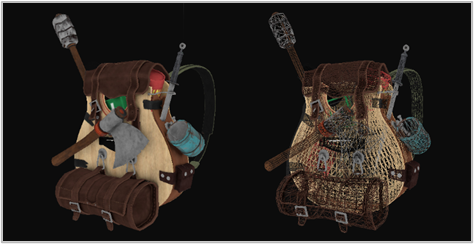
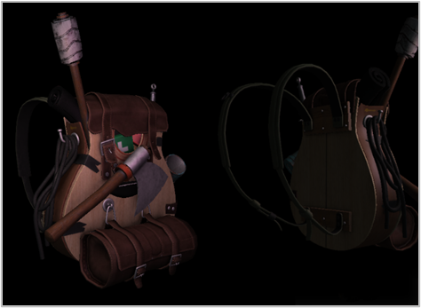

# Model

Now it is time to get our hands dirty with Assimp and start creating the actual loading and translation code. The goal of this chapter is to create another class that represents a model in its entirety, that is, a model that contains multiple meshes, possibly with multiple textures. A house that contains a wooden balcony, a tower, and perhaps a swimming pool, could still be loaded as a single model. We'll load the model via Assimp and translate it to multiple Mesh objects we've created in the [previous](2-Mesh.md) chapter.

Without further ado, I present you the class structure of the `Model` class:

```cs
public class Model {
  // Model data
  public List<Mesh> meshes;

  // Constructor, expects a filepath to a 3D model.
  // Assimp supports many common file formats including .fbx, .obj, .blend and many others
  // Check out http://assimp.sourceforge.net/main_features_formats.html for a complete list.
  public Model(string path);
  private void ProcessNode(Node node, Scene scene, Matrix4 parentTransform);
  private Mesh ProcessMesh(AssimpMesh mesh, Matrix4 transform);
}
```
The `Model` class contains a list of `Mesh` objects and requires us to give it a file location in its constructor. It then loads the file right away. The private functions are all designed to process a part of Assimp's import routine and we'll cover them shortly.

To import a model and translate it to our own structure, we first need to include `Assimp namespace` and specify that we want to use `AssimpMesh` __instead of__ `Mesh` to avoid confusion between our `Mesh` class and so that the compiler will know which one we intend:

```cs
using Assimp;
using AssimpMesh = Assimp.Mesh;
```

The first we use `Assimp` to load the model into a data structure of `Assimp` called a `scene object`. You may remember from the [first](Assimp.md) chapter of the model loading series that this is the root object of Assimp's data interface. Once we have the scene object, we can access all the data we need from the loaded model.

The great thing about Assimp is that it neatly abstracts from all the technical details of loading all the different file formats and does all this with a single one-liner.
We also define a logstream (log event\callback) to log messages:
```cs
LogStream logstream = new LogStream((String msg, String userData) => {
      Debug.WriteLine(msg);
  });
logstream.Attach();

Scene scene = importer.ImportFile(path, PostProcessSteps.Triangulate);
```
When we finish setting up, `logstream` will output this:
```
Info,  T20116: Load Resources/Backpack/Survival_BackPack_2.fbx
Info,  T20116: Found a matching importer for this file format: Autodesk FBX Importer.
Info,  T20116: Import root directory is 'Resources/Backpack\'
Error, T20116: FBX: no material assigned to mesh, setting default material
Skipping one or more lines with the same contents
Info,  T20116: Entering post processing pipeline
Info,  T20116: TriangulateProcess finished. All polygons have been triangulated.
Info,  T20116: Leaving post processing pipeline
```
Now how do we actually import the object?

We first declare an Importer object from Assimp's namespace and then call its `ImportFile` function. The function expects a file path and several post-processing options as its second argument. Assimp allows us to specify several options that forces Assimp to do extra calculations/operations on the imported data. By setting `PostProcessSteps.Triangulate` we tell Assimp that if the model does not (entirely) consist of triangles, it should transform all the model's primitive shapes to triangles first. 

- `PostProcessSteps.FlipUVs` flips the texture coordinates on the y-axis where necessary during processing 
- `PostProcessSteps.GenerateNormals`: creates normal vectors for each vertex if the model doesn't contain normal vectors.
- `PostProcessSteps.SplitLargeMeshes`: splits large meshes into smaller sub-meshes which is useful if your rendering has a maximum number of vertices allowed and can only process smaller meshes.
- `PostProcessSteps.OptimizeMeshes`: does the reverse by trying to join several meshes into one larger mesh, reducing drawing calls for optimization.

Assimp provides a great set of postprocessing options and you can find all of them [here](http://assimp.sourceforge.net/lib_html/postprocess_8h.html) (this is the `C++` libraries, but you can pretty easily find a match within the `PostProcessSteps enum`). Loading a model via Assimp is (as you can see) surprisingly easy. The hard work is in using the returned scene object to translate the loaded data to an array of Mesh objects.

The complete ctor function is listed here:

```cs
private void Model(string path) {
  AssimpContext importer = new AssimpContext();

  // We can define a logging callback function that 
  // receives messages during the ImportFile method and print them to the debug console.
  // These give information about which step is happening in the import such as:
  //      "Info, T18696: Found a matching importer for this file format: Autodesk FBX Importer."
  // or it can give you important error information such as:
  //      "Error, T18696: FBX: no material assigned to mesh, setting default material"
  LogStream logstream = new LogStream((String msg, String userData) => {
      Debug.WriteLine(msg);
  });
  logstream.Attach();

  // Import the model into managed memory with any PostProcessPreset or PostProcessSteps we desire.
  // Because we only want to render triangles in OpenGL, we are using the PostProcessSteps.Triangulate enum
  // to tell Assimp to automatically convert quads or ngons into triangles.
  Scene scene = importer.ImportFile(path, PostProcessSteps.Triangulate);

  // Check for errors
  if (scene == null || scene.SceneFlags.HasFlag(SceneFlags.Incomplete) || scene.RootNode == null) {
      Console.WriteLine("Unable to load model from: " + path);
      return;
  }

  // Create an empty list to be filled with meshes in the ProcessNode method
  meshes = new List<Mesh>();

  // Set the scale of the model. Ideally, the creator of the model would set the initial scale
  // and then any further scaling of each instance would take place in the "model" matrix that is passed to the shader.
  float scale = 1/200.0f;
  Matrix4 scalingMatrix = Matrix4.CreateScale(scale);

  // Process ASSIMP's root node recursively. We pass in the scaling matrix as the first transform
  ProcessNode(scene.RootNode, scene, scalingMatrix);

  // Once we are done with the importer, we release the resources since all the data we need
  // is now contained within our list of processed meshes
  importer.Dispose();
}
```
> Note, we could have used `using` on `AssimpContext importer` and remove `Dispose()`
since it implements `IDisposable`, and what `using` statement does, is calling `Dispose()` when its done
> ```cs
> using AssimpContext importer = new AssimpContext();
> ```


After we load the model, we check if the scene and the root node of the scene are not null and check one of its [flags](https://learn.microsoft.com/en-us/dotnet/csharp/language-reference/builtin-types/enum) to see if the returned data is incomplete. If any of these error conditions are met, we write the error to the console and return. Depending on your implementation you can throw an error here
> Note you can make your own flags enum: [link to ms docs](https://learn.microsoft.com/en-us/dotnet/csharp/language-reference/builtin-types/enum) ex. `Days.Monday | Days. Weekends`

If nothing went wrong, we reset the meshes list to prevent double loading of the meshes. For now, we define a scale (in the future, we would want to give a scale to individual instances of a model with the model matrix that is passed to the shader instead during the initial loading). We then define a scaling Matrix4x4 that simply has the scale value along the diagonal, except for a 1 in the bottom right corner.

Next, we want to process all of the scene's nodes. We pass the root node (first node) to the recursive `ProcessNode` function. Because each node (possibly) contains a set of children we want to first process the node in question, and then continue processing all the node's children and so on. This fits a recursive structure, so we'll be defining a recursive function. A recursive function is a function that does some processing and recursively calls the same function with different parameters until a certain condition is met. In our case the exit condition is met when all nodes have been processed.

In Assimp's structure, each node contains a set of mesh indices where each index points to a specific mesh located in the scene object. We thus want to retrieve these mesh indices, retrieve each mesh, process each mesh, and then do this all again for each of the node's children nodes. The content of the `ProcessNode` function is shown below.

But before that, we need to clear a simple hurdle, 
Assimp uses its own 
- `Matrix4x4`, OpenTk uses `Matrix4`,
- `Vector3D`, OpenTk uses `Vector3`

so to easily convert all and round, we will introduce extension methods:
```cs
public static class Extensions {
    public static Vector3 ConvertAssimpVector3(this Vector3D AssimpVector) {
        // Reinterpret the assimp vector into an OpenTK vector.
        return Unsafe.As<Vector3D, Vector3>(ref AssimpVector);
    }

    public static Matrix4 ConvertAssimpMatrix4(this Matrix4x4 AssimpMatrix) {
        // Take the column-major assimp matrix and convert it to a row-major OpenTK matrix.
        return Matrix4.Transpose(Unsafe.As<Matrix4x4, Matrix4>(ref AssimpMatrix));
    }
}
```
now in our code all is neat and shiny
```cs
private void ProcessNode(Node node, Scene scene, Matrix4 parentTransform) {
  // Multiply the transform of each node by the node of the parent, this will place the meshes in the correct relative location
  Matrix4 transform = node.Transform.ConvertAssimpMatrix4() * parentTransform;

  // Process each mesh located at the current node
  for (int i = 0; i < node.MeshCount; i++) {
      // Nodes don't actually carry any of the mesh data, but rather give an index to the corresponding Mesh
      // within the scene.Meshes List. The Nodes form the hierarchy of the model so that we can establish 
      // parent-child relationships, which are important for passing along transformations.
      AssimpMesh mesh = scene.Meshes[node.MeshIndices[i]];
      meshes.Add(ProcessMesh(mesh, transform));
  }

  for (int i = 0; i < node.ChildCount; i++) {
      ProcessNode(node.Children[i], scene, transform);
  }
}
```
We first multiply the local transform of the mesh by the cumulative transform mat from its parent (Note that initially this is just the scaling matrix and would need to be the identity matrix if we were not scaling here). We then check each of the node's mesh indices and retrieve the corresponding mesh by indexing the scene's Meshes array. The returned mesh is then passed to the ProcessMesh function that returns a `Mesh` object that we can store in the meshes list.

Once all the meshes have been processed, we iterate through all of the node's children and call the same `ProcessNode` function for each of its children. Once a node no longer has any children, the recursion stops.

A careful reader may have noticed that we could forget about processing any of the nodes and simply loop through all of the scene's meshes directly, without doing all this complicated stuff with indices. The reason we're doing this is that the initial idea for using nodes like this is that it defines a parent-child relation between meshes. By recursively iterating through these relations, we can define certain meshes to be parents of other meshes.

An example use case for such a system is when you want to translate a car mesh and make sure that all its children (like an engine mesh, a steering wheel mesh, and its tire meshes) translate as well; such a system is easily created using parent-child relations.

This is important because our test model has parent-child relationships that are needed to define the transformation of each mesh. This is why it is generally recommended to stick with this approach for whenever you want extra control over your mesh data. These node-like relations are after all defined by the artists who created the models.

The next step is to process Assimp's data into the `Mesh` class from the previous chapter.

### **Assimp to Mesh**

Translating an AssimpMesh object to a mesh object of our own is not too difficult. All we need to do is access each of the mesh's relevant properties and store them in our own object. The general structure of the processMesh function then becomes:
```cs
private Mesh ProcessMesh(AssimpMesh mesh, Matrix4 transform) {
  // Data to fill
  List<Vertex> vertices = new List<Vertex>();
  List<int> indices = new List<int>();

  // Calculate the inverse matrix once, so we don't need to do it for every vertex.
  // This matrix in combination with Vector3.TransformNormalInverse is used to transform normal vectors.
  Matrix4 inverseTransform = Matrix4.Invert(transform);
  
  // Walk through each of the mesh's vertices
  for (int i = 0; i < mesh.VertexCount; i++) {
      Vertex vertex = new Vertex();

      // Positions
      Vector3 position = mesh.Vertices[i].ConvertAssimpVector3();
      Vector3 transformedPosition = Vector3.TransformPosition(position, transform);
      vertex.Position = transformedPosition;
      
      // Normals
      if (mesh.HasNormals) { add normals}

      // Texture coordinates
      if (mesh.HasTextureCoords(0)) { add texture coords} 
      else vertex.TexCoords = new Vector2(0.0f, 0.0f);

      vertices.Add(vertex);
  }
  for (int i = 0; i < mesh.FaceCount; i++) {
      ..add indices...
  }

  // If we were targeting .net 5+ we could use
  //      return new Mesh(CollectionsMarshal.AsSpan(vertices), CollectionsMarshal.AsSpan(indices));
  // to avoid making a copy of all the vertex data.
  return new Mesh(vertices.ToArray(), indices.ToArray());
}
```
> Note why we use span, read [here](https://learn.microsoft.com/en-us/archive/msdn-magazine/2018/january/csharp-all-about-span-exploring-a-new-net-mainstay)

First we apply the local transformation by multiplying the transform matrix by the vertex. Note that we use `ConvertAssimpVector3` for transferring Assimp's data to OpenTks'. This is necessary as Assimp maintains its own data types for vector, matrices, strings etc. and we need to manually convert to gl's or OpenTk's data types.

Assimp calls their vertex position array Vertices which isn't the most intuitive name.

The procedure for normals should come as no surprise now:

```cs
Vector3 normal = mesh.Normals[i].ConvertAssimpVector3();
Vector3 transformedNormal = Vector3.TransformNormalInverse(normal, inverseTransform);
vertex.Normal = transformedNormal;
```

Texture coordinates are roughly the same, but Assimp allows a model to have up to 8 different texture coordinates per vertex. We're not going to use 8, we only care about the first set of texture coordinates. We'll also want to check if the mesh actually contains texture coordinates (which may not be always the case):

```cs
if (mesh.HasTextureCoords(0)) {// does the mesh contain texture coordinates?
  Vector2 vec;
  vec.X = mesh.TextureCoordinateChannels[0][i].X;
  vec.Y = mesh.TextureCoordinateChannels[0][i].Y;
  vertex.TexCoords = vec;
} else vertex.TexCoords = new Vector2(0.0f, 0.0f);
```

> Note that we did not want to transform the UV coordinates since they don't reside in 3D space like the positions and normals. 

The vertex struct is now completely filled with the required vertex attributes and we can add it to the back of the vertices list at the end of the iteration. This process is repeated for each of the mesh's vertices.

## Indices

Assimp's interface defines each mesh as having an array of faces, where each face represents a single primitive, which in our case (due to the `PostProcessSteps.Triangulate` option) are always triangles. A face contains the indices of the vertices we need to draw in what order for its primitive. So if we iterate over all the faces and store all the face's indices in the indices vector we're all set:

```cs
for (int i = 0; i < mesh.FaceCount; i++)
  Face face = mesh.Faces[i];
  for (int j = 0; j < face.IndexCount; j++)
      indices.Add(face.Indices[j]);
```

After the outer loop has finished, we now have a complete set of vertices and index data for drawing the mesh via `GL.DrawElements`. However, we still need to deal with adding some materials.

## Material

Assimp scenes can contain material information, but for simplicity we will just be applying a texture similar to how we did it in the Textures chapter.

Some versions of Assimp tend to load models quite slow when using the debug version and/or the debug mode of your IDE, so be sure to test it out with release versions as well if you run into slow loading times.

You can find the complete source code of the Model class [here](https://learnopengl.com/code_viewer_gh.php?code=includes/learnopengl/model.h).

#
# **No more containers!**, farewell boxy  

So let's give our implementation a spin by actually importing a model created by genuine artists, not something done by the creative genius that I am. Because I don't want to give myself too much credit, I'll occasionally allow some other artists to join the ranks and this time we're going to load this amazing [Survival Guitar Backpack](https://sketchfab.com/3d-models/survival-guitar-backpack-low-poly-799f8c4511f84fab8c3f12887f7e6b36) by Berk Gedik. Note that there's a few extra texture types we won't be using yet, and that all the textures and the model file(s) should be located in the same directory for the textures to load.

Within the `OnLoad()` function we will need to load the model, shader, and texture. We declare a Model object and pass in the model's file location.

```cs
_backPack = new Model("Resources/Backpack/Survival_BackPack_2.fbx");
_backPackShader = new Shader("Shaders/shader.vert", "Shaders/shader.frag");
_backPackTexture = Texture.LoadFromFile("Resources/Backpack/1001_albedo.jpg");
```
Within the `OnRenderFrame` function we set up the uniforms for the shader, including binding the texture. We then call the Draw function for the model:

```cs
// First we setup the shader, including the texture uniform and then call the Draw() method on the imported model to draw all the contained meshes
_backPackShader.Use();
_backPackShader.SetMatrix4("model", Matrix4.Identity);
_backPackShader.SetMatrix4("view", _camera.GetViewMatrix());
_backPackShader.SetMatrix4("projection", _camera.GetProjectionMatrix());
_backPackTexture.Use(TextureUnit.Texture0);
_backPackShader.SetInt("texture0", 0);

// For each mesh in the model, bind the VAO (that contains all of the vertices and indices) and draw the triangles
foreach (Mesh mesh in _backPackModel.meshes) {
    GL.BindVertexArray(mesh.VAO);
    GL.DrawElements(PrimitiveType.Triangles, mesh.indicesCount, DrawElementsType.UnsignedInt, 0);
    GL.BindVertexArray(0);
}
```
That is it. We are now using a simple shaders where the fragment shader only outputs the object's diffuse texture, the result looks a bit like this:



You can find the complete source code [here](TODO: add link).

We can also get more creative and introduce point lights to the render equation as we learned from the [Lighting](../chapter2/2-basic-lighting.md) chapters and together with specular maps get amazing results (covered in next section):



Even I have to admit that this is maybe a bit more fancy than the containers we've used so far. Using Assimp you can load tons of models found over the internet. There are quite a few resource websites that offer free 3D models for you to download in several file formats. Do note that some models still won't load properly, have texture paths that won't work, or are simply exported in a format even Assimp can't read.

[How-To Texture Wavefront (.obj) Models for OpenGL](https://www.youtube.com/watch?v=4DQquG_o-Ac): great video guide by Matthew Early on how to set up 3D models in Blender so they directly work with the current model loader (as the texture setup we've chosen doesn't always work out of the box).