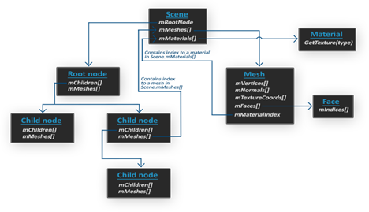

# Assimp

In all the scenes so far we've been extensively playing with our little container friend, but over time, even our best friends can get a little boring. In bigger graphics applications, there are usually lots of complicated and interesting models that are much prettier to look at than a static container. However, unlike the container object, we can't really manually define all the vertices, normals, and texture coordinates of complicated shapes like houses, vehicles, or human-like characters. What we want instead, is to _import_ these models into the application; models that were carefully designed by 3D artists in tools like [Blender](http://www.blender.org/), [3DS Max](http://www.autodesk.nl/products/3ds-max/overview) or [Maya](http://www.autodesk.com/products/autodesk-maya/overview).

These so-called 3D modeling tools allow artists to create complicated shapes and apply textures to them via a process called uv-mapping. The tools then automatically generate all the vertex coordinates, vertex normals, and texture coordinates while exporting them to a model file format we can use. This way, artists have an extensive toolkit to create high quality models without having to care too much about the technical details. All the technical aspects are hidden in the exported model file. We, as graphics programmers, **do** have to care about these technical details though.

It is our job to parse these exported model files and extract all the relevant information so we can store them in a format that OpenGL understands. A common issue is that there are dozens of different file formats where each exports the model data in its own unique way. Model formats like the [Wavefront .obj](http://en.wikipedia.org/wiki/Wavefront_.obj_file) only contains model data with minor material information like model colors and diffuse/specular maps, while model formats like the XML-based [Collada file format](http://en.wikipedia.org/wiki/COLLADA) are extremely extensive and contain models, lights, many types of materials, animation data, cameras, complete scene information, and much more. The wavefront object format is generally considered to be an easy-to-parse model format. It is recommended to visit the Wavefront's wiki page at least once to see how such a file format's data is structured. This should give you a basic perception of how model file formats are generally structured.

All by all, there are many different file formats where a common general structure between them usually does not exist. So if we want to import a model from these file formats, we'd have to write an importer ourselves for each of the file formats we want to import. Luckily for us, there just happens to be a library for this.

## **A model loading library**

A very popular model importing library out there is called [Assimp](http://assimp.org/) that stands for _Open Asset Import Library_ (we will be using a wrapper library called [AssimpNet](https://github.com/assimp/assimp-net)). Assimp is able to import dozens of different model file formats (and export to some as well) by loading all the model's data into Assimp's generalized data structures. As soon as Assimp has loaded the model, we can retrieve all the data we need from Assimp's data structures. Because the data structure of Assimp stays the same, regardless of the type of file format we imported, it abstracts us from all the different file formats out there.

When importing a model via Assimp it loads the entire model into a _scene_ object that contains all the data of the imported model/scene. Assimp then has a collection of nodes where each node contains indices to data stored in the scene object where each node can have any number of children. A (simplistic) model of Assimp's structure is shown below:

- All the data of the scene/model is contained in the Scene object like all the materials and the meshes. It also contains a reference to the root node of the scene.
- The Root node of the scene may contain children nodes (like all other nodes) and could have a set of indices that point to mesh data in the scene object's mMeshes array. The scene's mMeshes (just Meshes for AssimpNet) array contains the actual Mesh objects, the values in the mMeshes array of a node are only indices for the scene's meshes array.
- A Mesh object itself contains all the relevant data required for rendering, think of vertex positions, normal vectors, texture coordinates, faces, and the material of the object.
- A mesh contains several faces. A Face represents a render primitive of the object (triangles, squares, points). A face contains the indices of the vertices that form a primitive. Because the vertices and the indices are separated, this makes it easy for us to render via an index buffer (see [Hello Triangle](../chapter1/2-hello-triangle.md)).
- Finally a mesh also links to a Material object that hosts several functions to retrieve the material properties of an object. Think of colors and/or texture maps (like diffuse and specular maps).

What we want to do is: first load an object into a Scene object, recursively retrieve the corresponding Mesh objects from each of the nodes (we recursively search each node's children), and process each Mesh object to retrieve the vertex data, indices, and its material properties. The result is then a collection of mesh data that we want to contain in a single Model object.

## Mesh

When modeling objects in modeling toolkits, artists generally do not create an entire model out of a single shape. Usually, each model has several sub-models/shapes that it consists of. Each of those single shapes is called a mesh. Think of a human-like character: artists usually model the head, limbs, clothes, and weapons all as separate components, and the combined result of all these meshes represents the final model. A single mesh is the minimal representation of what we need to draw an object in OpenGL (vertex data, indices, and material properties). A model (usually) consists of several meshes.

In the [next](Mesh.md) chapters we'll create our own Model and Mesh class that load and store imported models using the structure we've just described. If we then want to draw a model, we do not render the model as a whole, but we render all of the individual meshes that the model is composed of. However, before we can start importing models, we first need to actually include Assimp in our project.

## Adding AssimpNet via NuGet

You can easily add AssimpNet to your project using the NuGet package manager. Search for AssimpNet by Nicholas Woodfield.